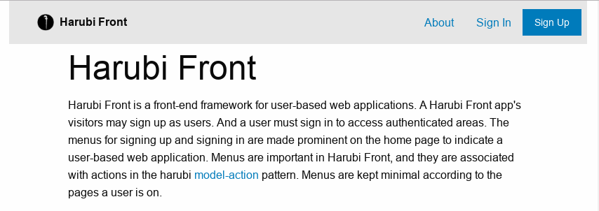

# Harubi Front
Harubi Front is a web application development framework. Today, every new application is developed based on frameworks. An application serves a purpose. However, to serve the purpose the application needs fundamental supports such as user management, multi-page navigation, internationalization/translations, data entry and visualization, searching and filtering, database management, etc. Those fundamental supports are being provided by frameworks. A framework will free developers from the fundamental works, and will let them focus on developing the true purpose of the application. 

### Introduction
Harubi Front is a front-end web applications development framework based on [React](https://reactjs.org) and [Foundation](https://foundation.zurb.com), and loosely coupled with harubi back-end. [Harubi](https://github.com/chelahmy/harubi) is all about back-ends. Initially, Harubi Front was an attempt for a harubi front-end. In fact, Harubi Front does not really rely on harubi for back-end. Decoupling front-end and back-end prevents unneeded code fusion, and loosens unnecessary intertwined concerns of development. Generally for a back-end, it can be multiple front-ends such as for web, mobile and IoT.

Harubi Front renders front-end with javascript. It uses React component-based structuring to render dynamic user interfaces and contents. It makes minimal calls to back-end. Harubi Front is optimized for mobile web.

The following image is a screenshot of a typical Harubi Front application:



**Framework modules**: React is used for structuring. And Foundation is used for micro-structuring and theming. Analogously, React is used to construct a building, and Foundation is used for finishing. Both of them make a powerful front-end framework. Coupling with harubi [model-action](https://github.com/chelahmy/harubi/tree/master/templates/models) pattern all of them make a great development framework.

**React and Foundation**: Forms for signing up, signing in and other actions are based on Foundation Form and Abide. The top bar and its menus are also based on Foundation. The responsive styling is also based on Foundation. Anything visible is being styled with Foundation. However, underneath all of them is a structure based on crafted React components. Harubi Front development always starts with React structuring.

Harubi Front is an extension of [Foundation-React Template](https://github.com/chelahmy/foundation-react-template). Please refer to the Foundation-React Template documentation for details on dependencies and tool-chain. This extension added the [PHP development server](https://www.php.net/manual/en/features.commandline.webserver.php) to [Browsersync](https://browsersync.io/).

## Prerequisites
The tool-chain requires [npm](https://www.npmjs.com/) which comes together with [nodejs](https://nodejs.org/en/). However, they are not required for deployment. Npm will be used to download all other dependencies for the build tool-chain. [Git](https://git-scm.com/) is used to clone this repository, or it can just be downloaded here. The harubi back-end requires [PHP](https://www.php.net/) and [MySQL](https://www.mysql.com/), both during development and deployment. 

## Installation
Clone this repository into a folder
```
$ git clone https://github.com/chelahmy/harubi-front.git my-project
$ cd my-project
```
and run the following command to download all dependencies including Foundation and React.
```
$ npm i
```

### Database setup
Create a `harubi_front` database in MySQL, and create the `user` table using the `src/backend/user.install.sql` script. Please refer to [harubi](https://github.com/chelahmy/harubi) for more details.

## How-to
Start the project.
```
$ npm start
```
The tool-chain will build the project into the `dist` folder and run it in a browser. Any changes made in the `src` folder will trigger the tool-chain to rebuild the project and push the changes to the browser in real time. Remove the `dist` folder to rebuild the project.

Begin with the `src/index.html`, `src/js/app.js`, `src/scss/app.scss` and `src/backend/serve.php` files. The resulting `dist` is standalone and can be deployed to a PHP and MySQL web server.

For building the project without watching the source files and triggering the browser
```
$ npm run build
```
